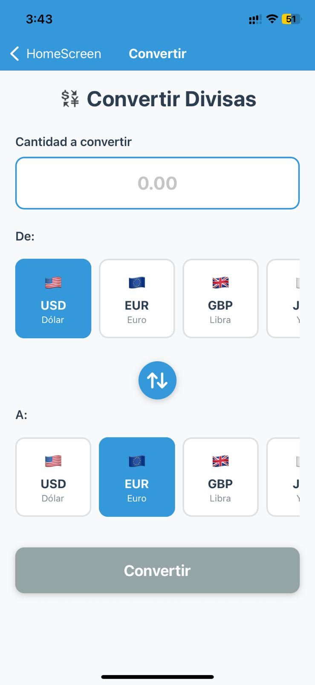
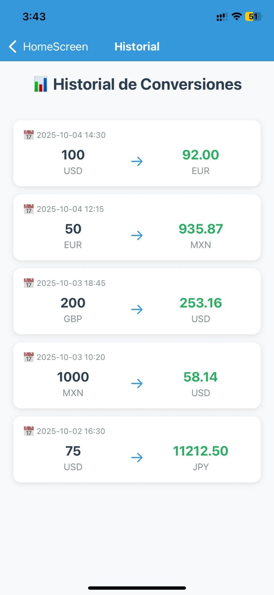
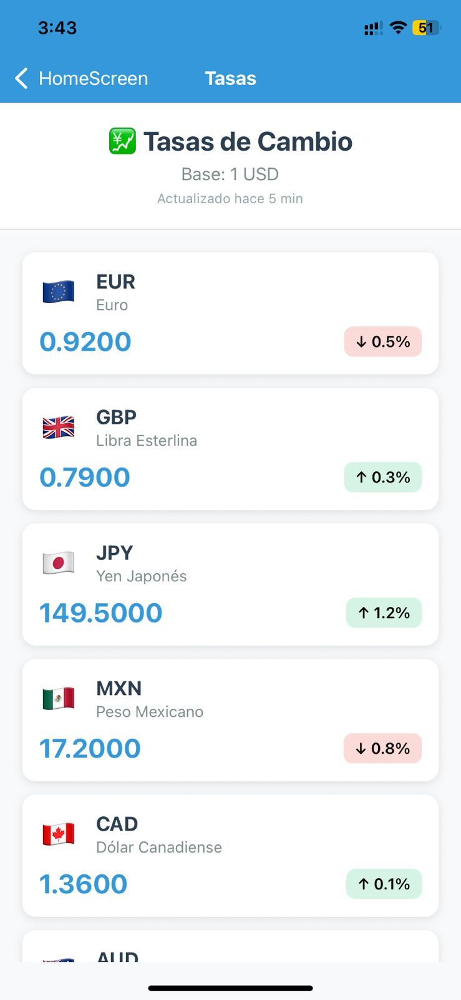
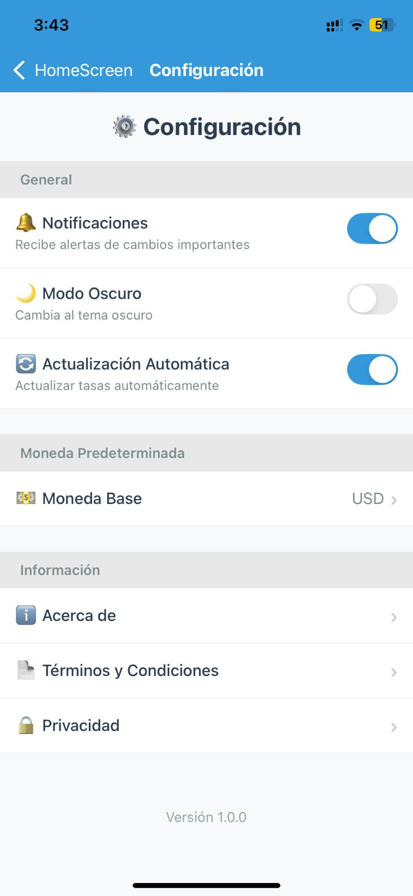

# 💰 Convertidor de Divisas


---

## 📋 Información del Proyecto

- **Nombre de la App:** Convertidor de Divisas
- **Asignatura/Profesor:** Desarrollo de Aplicaciones Móviles / M.C. Leonel González Vidales
- **Periodo/Fecha:** Octubre 2025
- **URL del Repositorio:**  (https://github.com/GilRC-super/Conversor)
- **Desarrollador:** Gilberto Rebollar Carranza 

---

## 📖 Descripción

**Convertidor de Divisas** es una aplicación móvil desarrollada con React Native y Expo que permite a los usuarios realizar conversiones entre diferentes monedas del mundo utilizando tasas de cambio en tiempo real obtenidas de una API externa. La aplicación cuenta con persistencia de datos local, historial de conversiones, y una interfaz moderna e intuitiva.

---

## ✨ Características Principales

- 💱 **Conversión de Divisas:** Convierte entre 6 monedas principales (USD, EUR, GBP, JPY, MXN, CAD)
- 📊 **Historial:** Guarda y visualiza todas tus conversiones anteriores
- 💹 **Tasas Actuales:** Consulta las tasas de cambio en tiempo real
- ⚙️ **Configuración:** Personaliza la aplicación según tus preferencias
- 🎨 **Interfaz Moderna:** Diseño limpio con colores vibrantes y navegación fluida
- 🧭 **Navegación Intuitiva:** Sistema de navegación stack con transiciones suaves
- 🔄 **Intercambio Rápido:** Botón para intercambiar monedas de origen y destino
- 📱 **Diseño Responsivo:** Optimizado para diferentes tamaños de pantalla

---

## 📸 Capturas de Pantalla

### Pantalla de Inicio

Menú principal con 4 opciones principales organizadas en tarjetas coloridas.

### Conversión de Divisas

Interfaz intuitiva para convertir entre diferentes monedas con selección visual de banderas.

### Historial de Conversiones

Lista completa de todas las conversiones realizadas con fecha y hora.

### Tasas de Cambio

Visualización de tasas actuales con indicadores de cambio porcentual.

### Configuración

Personalización de la aplicación con switches y opciones de usuario.

---

## 🎯 Funcionalidades por Pantalla

### 🏠 Pantalla de Inicio (HomeScreen)
- Lista de 4 opciones principales
- Navegación directa a cada sección
- Diseño con iconos y colores distintivos
- Tarjetas interactivas con efecto hover

### 💱 Conversión de Divisas (ConvertScreen)
- Campo de entrada numérico para cantidad
- Selección de moneda origen con scroll horizontal
- Selección de moneda destino con scroll horizontal
- Botón de intercambio rápido (⇅)
- Visualización de resultado con tasa de cambio
- Banderas de países para mejor identificación
- Cálculo automático al presionar "Convertir"

### 📊 Historial (HistoryScreen)
- Lista de conversiones ordenadas por fecha
- Formato: Cantidad origen → Cantidad destino
- Timestamp completo (fecha y hora)
- Tarjetas individuales para cada conversión
- Diseño limpio y fácil de leer

### 💹 Tasas Actuales (RatesScreen)
- Lista completa de tasas de cambio
- Base: 1 USD
- Indicadores de cambio porcentual (↑/↓)
- Colores diferenciados (verde/rojo) según tendencia
- Banderas y nombres completos de monedas
- Timestamp de última actualización

### ⚙️ Configuración (SettingsScreen)
- **General:**
  - 🔔 Notificaciones (Switch on/off)
  - 🌙 Modo Oscuro (Switch on/off)
  - 🔄 Actualización Automática (Switch on/off)
- **Moneda Predeterminada:**
  - 💵 Selección de moneda base
- **Información:**
  - ℹ️ Acerca de
  - 📄 Términos y Condiciones
  - 🔒 Privacidad
- Versión de la aplicación en el footer

---

## 🛠️ Tecnologías Utilizadas

### Core
- **React Native:** 0.81.4
- **React:** 19.1.0
- **Expo:** ~54.0.3
- **TypeScript:** 5.3.3

### Navegación
- **React Navigation (Native):** v7.1.17
- **React Navigation (Native Stack):** v7.3.26
- **React Native Screens:** ~4.16.0
- **React Native Safe Area Context:** ~5.6.0

### Persistencia de Datos
- **AsyncStorage:** @react-native-async-storage/async-storage

### API Externa
- **ExchangeRate-API:** Tasas de cambio en tiempo real
- **Fetch API:** Peticiones HTTP nativas

### Utilidades
- **Expo Status Bar:** ~3.0.8

---

## 📋 Requisitos Previos

### Software Necesario

#### 1. Node.js
**Versión requerida:** v18.17.0 o superior

```bash
# Verificar instalación
node --version
```

#### 2. NPM o Yarn
**Versión requerida:** NPM 9.0.0+ o Yarn v1.22.19+

```bash
# Verificar instalación
npm --version
# o
yarn --version
```

#### 3. Expo CLI
**Versión requerida:** v6.3.0+

```bash
# Verificar instalación
npx expo --version
```

#### 4. Entorno de Desarrollo

**Opción A - Dispositivo Físico (Recomendado para principiantes):**
- Instalar **Expo Go** desde:
  - [Google Play Store](https://play.google.com/store/apps/details?id=host.exp.exponent) (Android)
  - [Apple App Store](https://apps.apple.com/app/expo-go/id982107779) (iOS)

**Opción B - Emulador/Simulador:**
- **Android:** Android Studio v2022.3+ con Android SDK 33+
- **iOS:** Xcode (solo macOS)

```bash
# Verificar Android SDK (si usas Android Studio)
adb --version

# Verificar estado del entorno
npx expo doctor
```

---

## 📁 Estructura del Proyecto

```
currency-converter/
├── App.tsx                          # Componente raíz con NavigationContainer
├── app.json                         # Configuración de Expo
├── package.json                     # Dependencias y scripts
├── tsconfig.json                    # Configuración de TypeScript
├── README.md                        # Este archivo
├── .gitignore                       # Archivos ignorados por Git
├── assets/                          # Recursos estáticos (iconos, splash)
│   ├── adaptive-icon.png
│   ├── favicon.png
│   ├── icon.png
│   └── splash.png
└── src/
    ├── navigations/                 # Sistema de navegación
    │   ├── AppNavigation.tsx        # Configuración del Stack Navigator
    │   └── index.ts                 # Exportaciones
    ├── screens/                     # Pantallas de la aplicación
    │   ├── Home/
    │   │   ├── HomeScreen.tsx       # Pantalla principal con menú
    │   │   └── index.ts
    │   ├── Convert/
    │   │   ├── ConvertScreen.tsx    # Conversión con API en tiempo real
    │   │   └── index.ts
    │   ├── History/
    │   │   ├── HistoryScreen.tsx    # Historial desde base de datos
    │   │   └── index.ts
    │   ├── Rates/
    │   │   ├── RatesScreen.tsx      # Tasas actuales con API
    │   │   └── index.ts
    │   └── Settings/
    │       ├── SettingsScreen.tsx   # Configuración y estadísticas
    │       └── index.ts
    ├── services/                    # Servicios y lógica de negocio
    │   ├── api/
    │   │   ├── currencyApi.ts       # Integración con ExchangeRate-API
    │   │   └── index.ts
    │   ├── storage.ts               # Base de datos con AsyncStorage
    │   └── index.ts
    └── utils/                       # Utilidades y constantes
        ├── screens.ts               # Nombres de pantallas
        └── index.ts
```

### Descripción de Componentes Principales

- **App.tsx:** Componente raíz con NavigationContainer y AppNavigation
- **AppNavigation.tsx:** Configuración del Stack Navigator con todas las pantallas
- **HomeScreen.tsx:** Pantalla principal con menú de opciones
- **ConvertScreen.tsx:** Pantalla de conversión de divisas con lógica de cálculo
- **HistoryScreen.tsx:** Pantalla de historial con lista de conversiones
- **RatesScreen.tsx:** Pantalla de tasas actuales con datos simulados
- **SettingsScreen.tsx:** Pantalla de configuración con switches y opciones
- **screens.ts:** Constantes para nombres de pantallas (evita typos)

---

## 📦 Dependencias del Proyecto

| Dependencia | Versión | Propósito |
|------------|---------|-----------|
| `@react-navigation/native` | ^7.1.17 | Core de navegación entre pantallas, manejo de estado de navegación |
| `@react-navigation/native-stack` | ^7.3.26 | Stack navigator para navegación jerárquica |
| `react-native-screens` | ~4.16.0 | Optimización de rendimiento para transiciones nativas |
| `react-native-safe-area-context` | ~5.6.0 | Manejo de áreas seguras (notch, barras de estado) |
| `expo-status-bar` | ~3.0.8 | Control de apariencia de barra de estado |
| `expo` | ~54.0.3 | Framework de desarrollo móvil |
| `react` | 19.1.0 | Biblioteca de interfaz de usuario |
| `react-native` | 0.81.4 | Framework de desarrollo móvil multiplataforma |

### Verificar Dependencias Instaladas

```bash
npm list --depth=0
```

---

## 🚀 Instalación y Configuración

### Paso 1: Clonar el Repositorio

```bash
# Clonar el repositorio
git clone [URL-de-tu-repositorio]
cd currency-converter

# O si empiezas desde cero
npx create-expo-app@latest currency-converter --template blank-typescript
cd currency-converter
```

### Paso 2: Instalar Dependencias

```bash
# Instalar todas las dependencias del proyecto
npm install

# Instalar dependencias de navegación
npm install @react-navigation/native @react-navigation/native-stack

# Instalar dependencias de Expo
npx expo install react-native-screens react-native-safe-area-context
```

### Paso 3: Verificar Instalación

```bash
# Verificar que todo esté correcto
npx expo doctor
```

---

## ▶️ Ejecución del Proyecto

### Iniciar Servidor de Desarrollo

```bash
# Opción 1: Comando estándar
npm start

# Opción 2: Usando npx
npx expo start

# Opción 3: Con túnel (para redes restrictivas)
npx expo start --tunnel

# Opción 4: Limpiar caché
npx expo start --clear
```

### Ejecutar en Diferentes Plataformas

#### 📱 Android

```bash
# Opción 1: Usando npm
npm run android

# Opción 2: Usando npx
npx expo start --android

# Nota: Requiere Android Studio con emulador iniciado
# O dispositivo físico con depuración USB habilitada
```

#### 🍎 iOS (solo macOS)

```bash
# Opción 1: Usando npm
npm run ios

# Opción 2: Usando npx
npx expo start --ios

# Nota: Requiere Xcode instalado
```

#### 🌐 Web

```bash
# Opción 1: Usando npm
npm run web

# Opción 2: Usando npx
npx expo start --web

# Se abrirá automáticamente en el navegador
```

---

## 📱 Uso con Expo Go

### Método 1: Escanear Código QR

1. **Inicia el servidor:**
   ```bash
   npx expo start
   ```

2. **Abre Expo Go en tu dispositivo**

3. **Escanea el código QR:**
   - **Android:** Desde la app Expo Go
   - **iOS:** Con la cámara del iPhone (abre Expo Go automáticamente)

### Método 2: Conexión Manual

1. En la terminal, presiona:
   - `a` para Android
   - `i` para iOS
   - `w` para Web

### Método 3: Túnel (Redes Restrictivas)

```bash
npx expo start --tunnel
```
*Útil cuando tu computadora y teléfono están en redes diferentes*

---

## 💡 Guía de Uso de la Aplicación

### 1. Convertir Divisas

1. Desde la pantalla de inicio, toca **"Convertir Divisas"**
2. Ingresa la **cantidad** que deseas convertir
3. Selecciona la **moneda de origen** (De)
4. Selecciona la **moneda de destino** (A)
5. Presiona el botón **"Convertir"**
6. Visualiza el resultado con la tasa de cambio aplicada

**Tip:** Usa el botón **⇅** para intercambiar rápidamente las monedas

### 2. Ver Historial

1. Desde la pantalla de inicio, toca **"Historial"**
2. Revisa todas tus conversiones anteriores
3. Cada conversión muestra:
   - Fecha y hora
   - Cantidad origen → Cantidad destino
   - Monedas utilizadas

### 3. Consultar Tasas

1. Desde la pantalla de inicio, toca **"Tasas Actuales"**
2. Visualiza las tasas de cambio con base en 1 USD
3. Observa los indicadores de cambio:
   - **Verde (↑):** Tasa en alza
   - **Rojo (↓):** Tasa en baja

### 4. Configurar la App

1. Desde la pantalla de inicio, toca **"Configuración"**
2. Activa/desactiva:
   - Notificaciones
   - Modo oscuro
   - Actualización automática
3. Cambia la moneda base predeterminada
4. Accede a información adicional

---

## 🎨 Monedas Disponibles

| Código | Nombre | Símbolo | Bandera |
|--------|--------|---------|---------|
| USD | Dólar Estadounidense | $ | 🇺🇸 |
| EUR | Euro | € | 🇪🇺 |
| GBP | Libra Esterlina | £ | 🇬🇧 |
| JPY | Yen Japonés | ¥ | 🇯🇵 |
| MXN | Peso Mexicano | $ | 🇲🇽 |
| CAD | Dólar Canadiense | $ | 🇨🇦 |

---

## 🔧 Solución de Problemas

### Problemas Comunes

| Problema | Solución |
|----------|----------|
| **Error al instalar dependencias** | `npm install --legacy-peer-deps` |
| **Metro cache corrupto** | `npx expo start --clear` |
| **Puerto 8081 ocupado** | `npx expo start --port 8082` |
| **Dependencias desactualizadas** | `npx expo doctor` |
| **Expo Go no se conecta** | `npx expo start --tunnel` |
| **Cambios no se reflejan** | Presiona `r` en la terminal para reload |

### Comandos de Diagnóstico

```bash
# Verificar estado del entorno
npx expo doctor

# Limpiar caché de Metro
npx expo start --clear

# Reinstalar dependencias
rm -rf node_modules package-lock.json
npm install

# Verificar versión de Node
node --version

# Verificar versión de Expo
npx expo --version
```

### Errores Específicos

#### Error: "Unable to resolve module"
```bash
# Solución
npm install
npx expo start --clear
```

#### Error: "Network error"
```bash
# Solución 1: Usar túnel
npx expo start --tunnel

# Solución 2: Verificar misma red WiFi
# Asegúrate que PC y móvil estén en la misma red
```

#### Error: "Metro has encountered an error"
```bash
# Solución
watchman watch-del-all
npx expo start --clear
```

---

## 🚀 Próximas Mejoras

### Funcionalidades Planeadas

- [ ] **Integración con API Real:** Conectar con API de tasas de cambio (ej: exchangerate-api.com)
- [ ] **Persistencia de Datos:** Guardar historial con AsyncStorage
- [ ] **Modo Offline:** Cachear últimas tasas para uso sin conexión
- [ ] **Más Monedas:** Expandir a 20+ monedas internacionales
- [ ] **Gráficos:** Visualizar tendencias de tasas con charts
- [ ] **Favoritos:** Marcar pares de monedas favoritos para acceso rápido
- [ ] **Widget:** Conversión rápida desde la pantalla de inicio
- [ ] **Notificaciones Push:** Alertas de cambios significativos en tasas
- [ ] **Tema Personalizable:** Modo claro/oscuro dinámico
- [ ] **Calculadora:** Interfaz de calculadora integrada
- [ ] **Compartir:** Compartir conversiones por redes sociales
- [ ] **Multi-idioma:** Soporte para inglés, español, francés

---

## 🤝 Contribuciones

Las contribuciones son bienvenidas. Para cambios importantes:

1. **Fork** el proyecto
2. Crea una **rama** para tu feature (`git checkout -b feature/NuevaFuncionalidad`)
3. **Commit** tus cambios (`git commit -m 'Agrega nueva funcionalidad'`)
4. **Push** a la rama (`git push origin feature/NuevaFuncionalidad`)
5. Abre un **Pull Request**

---

## 📄 Licencia

Este proyecto es de código abierto y está disponible bajo la [Licencia MIT](LICENSE).

---

## 👨‍💻 Autor

**Gilberto Rebollar Carranza**
- GitHub: GilRC-super(https://github.com/GilRC-super)
- Email: gilreboc@gmail.com

---

## 📞 Soporte

Si tienes preguntas o problemas:
- 📧 Email: gilreboc@gmail.com
- 🐛 Issues: [GitHub Issues](link-a-tu-repo/issues)
- 📖 Documentación: [Wiki del Proyecto](link-a-tu-repo/wiki)

---

## 🙏 Agradecimientos

- [React Native](https://reactnative.dev/) - Framework de desarrollo
- [Expo](https://expo.dev/) - Plataforma de desarrollo
- [React Navigation](https://reactnavigation.org/) - Sistema de navegación
- [Profesor] - Guía y apoyo académico

---

<div align="center">

**Desarrollado con ❤️ usando React Native y Expo**

**Última actualización:** Octubre 2025  
**Versión:** 1.0.0

[⬆ Volver arriba](#-convertidor-de-divisas)

</div>